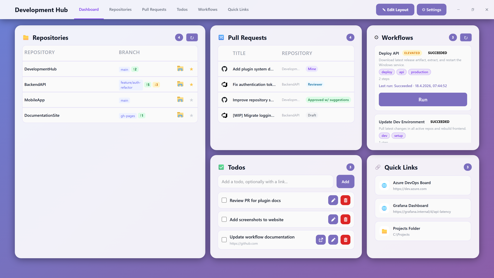
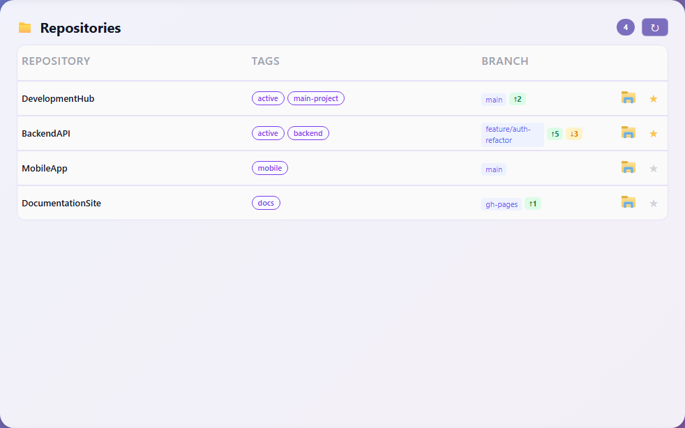
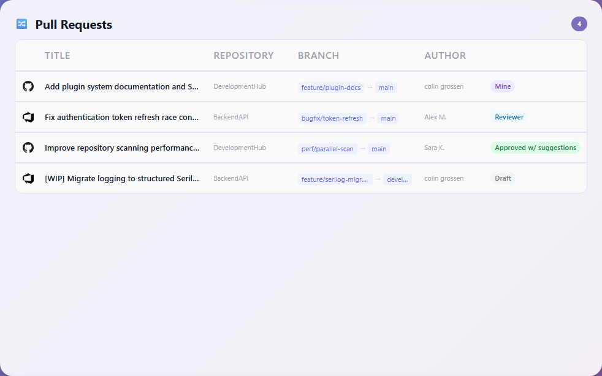
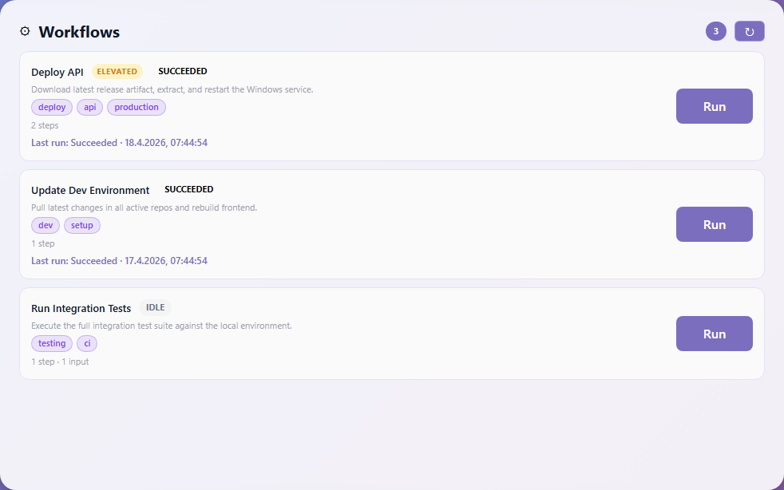
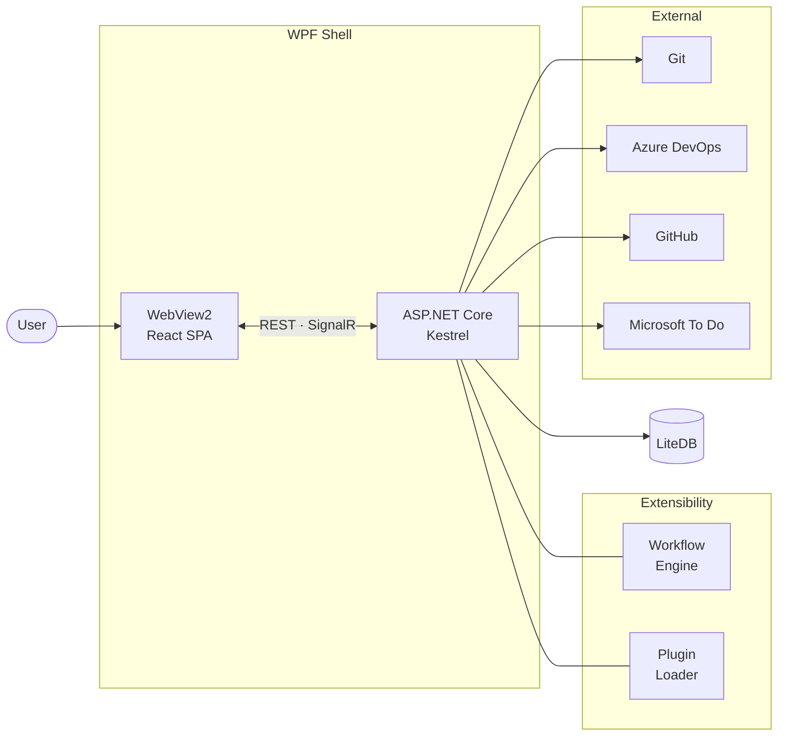

# DevelopmentHub 🧑‍💻

> Stop alt-tabbing. One hotkey. Everything.

[](https://github.com/SeBaconStrip/DevelopmentHub/actions/workflows/build.yml)
[](https://github.com/SeBaconStrip/DevelopmentHub/releases/latest)
[](LICENSE)




A single frameless window, always a keystroke away. Repos, PRs, todos, automation workflows, and plugins — no browser tabs, no alt-tab spiral.

---

## What's in the box

| | Feature | What it does |
|:---:|---|---|
| 🗂️ | **Repositories** | Scan local folders, see branch & ahead/behind, open in VS Code / Visual Studio / custom |
| 🔀 | **Pull Requests** | Unified Azure DevOps + GitHub feed — filter by Mine / Reviewer / Draft |
| ✅ | **Todos** | Local list with bidirectional Microsoft To Do sync |
| ⚙️ | **Workflows** | JSON-defined automation: scripts, downloads, services, UAC elevation |
| 🔗 | **Quick Links** | Pinned URLs and Explorer folders — one click |
| 🧩 | **Plugins** | Add widgets and full pages without touching the host |

---

## 🗂️ Repositories

All your repos. One place. Instant.



- **Scan** configured root folders — finds every Git repo automatically
- **See** branch name, ahead/behind status, and tags at a glance
- **Open** any repo in VS Code, Visual Studio, or a custom tool with one click
- **Multi-select** to open a shared `.code-workspace` across related repos
- **Filter and tag** to cut through large repo sets fast
- Inline warnings for fetch failures, invalid paths, or permission issues
- Real-time scan progress via SignalR — the list refreshes without F5

---

## 🔀 Pull Requests

Azure DevOps and GitHub. One feed. No browser juggling.



- Merged feed from both providers
- Filter by **All / Mine / Reviewer / Draft**
- Click a PR → opens in your browser via the companion **Edge extension** that reuses an existing tab instead of opening a new one

---

## ✅ Todos

Your todo list. Everywhere.

- **Local-first** — works offline, instant writes
- **Microsoft To Do sync** — bidirectional via Microsoft Graph
- Create, complete, restore, delete
- Background sync keeps both sides consistent — or hit **Sync Now** to force it

---

## ⚙️ Workflows

Automate the boring stuff. Without leaving the dashboard.



Define workflows in JSON, run them with one click. Tag them for quick filtering.

| Step type | What it does |
|---|---|
| `shellScript` | Run any shell command |
| `downloadFile` | Fetch from GitHub or Azure DevOps (authenticated) |
| `extractArchive` | Unzip to a target path |
| `patchJson` | Modify JSON config files in-place |
| `runExecutable` | Launch a process |
| `restartWindowsService` | Stop/start a Windows service |
| `callWorkflow` | Compose sub-workflows |

UAC elevation, static variables, built-in path variables, and real-time execution logs included.

```json
{
  "name": "Restart API Service",
  "runElevated": true,
  "tags": ["deploy"],
  "steps": [
    { "type": "restartWindowsService", "serviceName": "MyApiService" }
  ]
}
```

See [docs/workflow-engine/](docs/workflow-engine/) for the full schema, all step types, and examples.

---

## 🔗 Quick Links

Pinned URLs and Explorer folders. One click. Done.

---

## 🧩 Plugin System

Build anything on top. Ship it as a `.dll` + `bundle.js`.

Plugins contribute dashboard widgets and full pages without modifying the host. Each runs in an isolated `AssemblyLoadContext` — zero dependency conflicts.

**Install the SDKs:**
```bash
# .NET backend SDK
dotnet add package DevelopmentHub.Plugins

# TypeScript frontend types
npm install --save-dev @developmenthub/plugin-sdk
```

**Register a page from your frontend bundle:**
```typescript
window.__dhSdk.plugin.registerPage({
  id: 'my-page',
  label: 'My Page',
  icon: 'fa-solid fa-star',
  component: MyPage,
});
```

See [docs/plugins/](docs/plugins/) for the full guide, manifest reference, SDK API, and the worked counter-plugin example in `src/plugins/counter-plugin/`.

---

## ⚡ Get Started

### Install

**[→ Download the latest installer](https://github.com/SeBaconStrip/DevelopmentHub/releases/latest)**

Requires Windows 10/11. WebView2 Runtime ships with Windows 11; [download it separately](https://developer.microsoft.com/microsoft-edge/webview2/) on Windows 10.

### Development

```bash
# 1. Install frontend dependencies
cd src/web && npm ci

# 2. Start the dev server (hot reload on port 5173)
npm run dev

# 3. In a separate terminal, run the backend
cd src/app && dotnet run
```

The WPF window opens and loads the React dev server. Frontend changes update instantly — no restart needed.

### Production Build

```bash
cd src/app && dotnet publish -c Release -r win-x64 --self-contained -o ../../publish
```

Runs `npm run build` automatically and bundles the React output into the executable.

---

## 🔧 Configuration

Open **Settings** (gear icon) on first run:

| Setting | What you need |
|---|---|
| **Repositories → Folders** | Root directories to scan for Git repos |
| **Azure DevOps** | Org, project, user email, PAT (`Code: Read`, `Pull Request: Read`) |
| **GitHub** | PAT (`repo: read`, `user: read`) |
| **Microsoft To Do** | Azure AD app client ID (device-code auth flow) |

All settings are stored in `appsettings.local.json` (gitignored) and LiteDB.

---

## 🏗️ Architecture



```
src/
├── api/               ASP.NET Core backend (Kestrel, LiteDB, LibGit2Sharp)
├── app/               WPF host shell (WebView2 embeds the React frontend)
├── web/               React 19 + TypeScript + TailwindCSS SPA
├── plugins/           Plugin SDK — DevelopmentHub.Plugins NuGet + @developmenthub/plugin-sdk npm
├── workflow/          Workflow execution engine
├── browser-extension/ Microsoft Edge extension (tab reuse for PR links)
└── installer/         Inno Setup installer script
```

The WPF shell starts Kestrel in-process and opens a WebView2 control pointed at it. A per-process token is injected at startup — all API calls require the `X-Dev-Hub-Token` header. SignalR pushes real-time updates without polling. Plugins load into isolated `AssemblyLoadContext`s so their dependencies can't conflict with the host.

---

## 🛠️ Tech Stack

| Layer | Technology |
|---|---|
| Desktop shell | WPF + WebView2 (.NET 9) |
| Backend | ASP.NET Core 9, Kestrel |
| Database | LiteDB (embedded, no server) |
| Git | LibGit2Sharp |
| Real-time | SignalR |
| Frontend | React 19, TypeScript 5.9, Vite 7 |
| Styling | TailwindCSS 4 |
| State | Zustand 5, TanStack Query 5 |
| CI/CD | GitHub Actions → Inno Setup installer + GitHub Releases |

---

## 📚 Docs

| Topic | Link |
|---|---|
| Plugin system | [docs/plugins/](docs/plugins/) |
| Workflow engine | [docs/workflow-engine/](docs/workflow-engine/) |
| Frontend architecture | [docs/frontend-architecture.md](docs/frontend-architecture.md) |
| Contributing | [CONTRIBUTING.md](CONTRIBUTING.md) |
| Changelog | [CHANGELOG.md](CHANGELOG.md) |

---

## License

[MIT](LICENSE)
